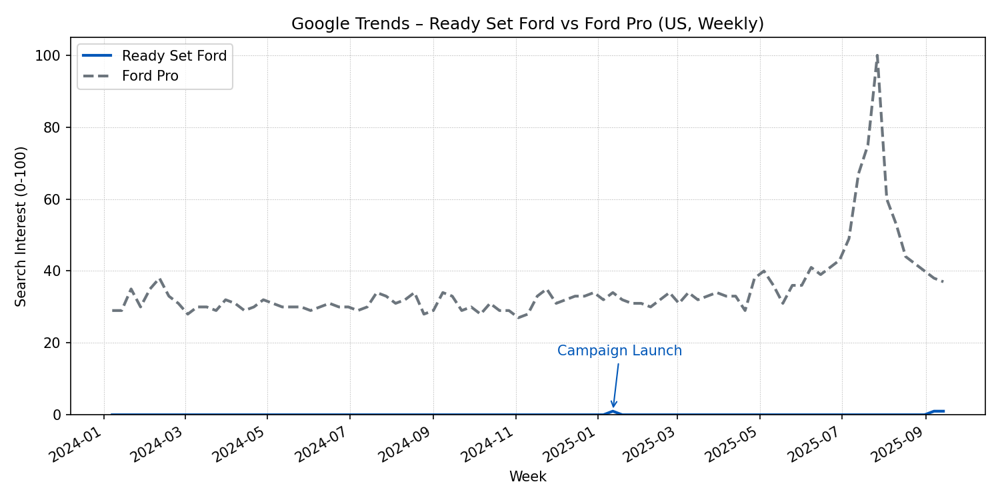

# Digital Pulse – Google Trends (US)

| Term | Peak Weekly Interest | Peak Week | Trailing 90-Day Avg | Gap vs. Ford Pro |
| --- | ---: | --- | ---: | ---: |
| Ready Set Ford | 2 | 2022-01-02 | 0.15 | -52.9 |
| Ford Pro | 100 | 2025-07-27 | 53.0 | – |

- Ready Set Ford searches finally registered measurable activity in September 2025 (index = 1) after a near-zero baseline, signalling early traction as campaign content rolls out.
- Ford Pro remains the awareness anchor with a steady ~53 trailing 90-day index; use the contrast to show why Pro proof points must be woven into Ready Set Ford storytelling.
- Overlay campaign milestones (video drops, dealer pushes) when presenting to explain spikes and set expectations for post-launch lift.

*Source: `google_trends_readysetford_us.csv` generated via `scripts/collect_additional_data.py` (22 Sep run).* 
